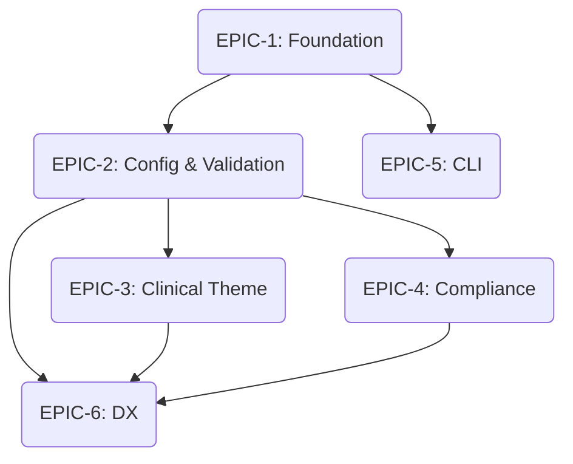

# Project Epics - prism

This document lists the functional epics for the Prism project, derived from the PRD and Architecture Decision Document.

## Epic List

| ID | Title | Priority | Status |
|---|---|---|---|
| EPIC-1 | [Engine Foundation & Core Integration](./epics/epic-1-foundation.md) | P0 | Not Started |
| EPIC-2 | [Configuration & Build Validation](./epics/epic-2-config-validation.md) | P0 | Not Started |
| EPIC-3 | [Clinical Theme & Component Library](./epics/epic-3-clinical-theme.md) | P1 | Not Started |
| EPIC-4 | [Compliance Engine](./epics/epic-4-compliance.md) | P0 | Not Started |
| EPIC-5 | [Fleet Management CLI](./epics/epic-5-cli.md) | P1 | Not Started |
| EPIC-6 | [Developer Experience & Starter Repo](./epics/epic-6-dx.md) | P1 | Not Started |

## Epic Relationships & Dependencies

