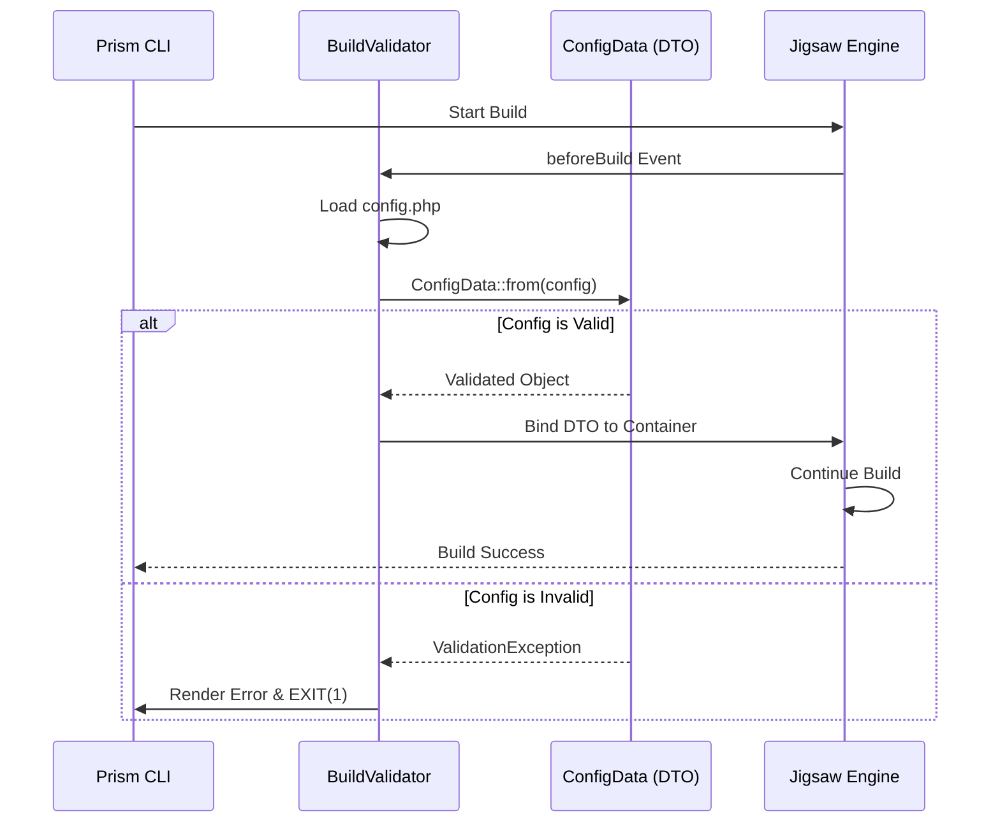

# The Prism Build Validation Pipeline

**Fail-Fast Safety for Reliable Static Site Generation**

In a fleet of 50+ sites, a single typo in a configuration file could break a production build or, worse, deploy a site with missing legal disclaimers. Prism prevents this using a rigorous **Build Validation Pipeline**.

## The Philosophy: Fail-Fast

Prism follows a "Fail-Fast" principle. If the configuration is invalid, the engine **stops immediately** and provides a clear error message. This prevents:
*   Broken HTML/CSS in production.
*   Regulatory non-compliance (missing FDA/AAFCO statements).
*   Developer frustration caused by cryptic Jigsaw errors.

## How It Works

### 1. The Build Hook
When you run `prism build`, the engine triggers Jigsaw's `beforeBuild` event. Prism registers the `BuildValidator` listener to this event.



### 2. Data Transfer Objects (DTOs)
The "Brain" of the validation is `ConfigData`. It uses **Spatie Laravel Data** to define exactly what a valid site configuration looks like using PHP 8.2+ attributes.

```php
// src/Data/ConfigData.php
final class ConfigData extends Data
{
    public function __construct(
        #[Required, StringType, Min(3)]
        public readonly string $project_name,

        #[Required, In(['clinical', 'playful', 'luxury', 'organic'])]
        public readonly string $theme_preset,

        #[Required, In(['none', 'supplements', 'pet_food'])]
        public readonly string $compliance_mode,
        
        // ... nested DTOs
    ) {}
}
```

### 3. The Validation Gate
The `BuildValidator` attempts to map the raw `config.php` array into the `ConfigData` DTO. If the array doesn't match the required types or constraints, a `ValidationException` is thrown.

```php
// src/Listeners/BuildValidator.php
try {
    $configData = ConfigData::from($config);
} catch (LaravelValidationException $exception) {
    // Format and display beautiful error messages
    $this->renderError($jigsaw, "Config Error:\n - " . $messages);
    exit(1); // STOP THE BUILD
}
```

## Benefits

1.  **Type Safety:** Ensures that if the code expects a string for a color, it actually gets one.
2.  **Regulatory Compliance:** By making `compliance_mode` required and restricted to specific values, we guarantee the engine knows which legal rules to apply.
3.  **Immediate Feedback:** Developers see exactly which field failed and why (e.g., `"theme_preset: The selected theme_preset is invalid"`) before the build even begins.
4.  **Polymorphic Validation:** The pipeline is smart enough to change validation rules based on the `compliance_mode` (e.g., if mode is `supplements`, it will also validate the `niche.supplements` configuration).

```