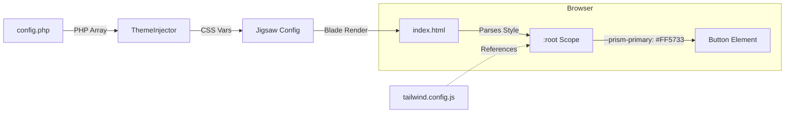

# CSS Variable Injection Engine

**Dynamic Branding in a Static Environment**

Static Site Generators (SSGs) usually lock design decisions at build time. However, Prism needs to support 50+ clients with different brand colors using a *single* compiled CSS file. We achieve this by injecting PHP configuration values directly into CSS variables at runtime.

## The Challenge

We want to change the primary brand color from "Eco Green" to "Luxury Gold" **without** rewriting the Tailwind configuration or maintaining 50 separate `tailwind.config.js` files.

## The Solution: The `ThemeInjector`

Prism uses a dedicated build listener, `ThemeInjector`, to bridge the gap between PHP configuration and CSS.

### 1. Data Source: `config.php`
The client defines their brand colors in the standard configuration file.

```php
// config.php
return [
    'brand_colors' => [
        'primary' => '#FF5733',   // Client specific orange
        'secondary' => '#333333',
    ],
];
```

### 2. The Bridge: `ThemeInjector.php`
This listener runs after the configuration has been validated. It extracts the colors and prepares them as standard CSS Custom Properties (Variables).

```php
// src/Listeners/ThemeInjector.php
public function handle(Jigsaw $jigsaw): void
{
    // 1. Retrieve the Validated Config
    $configData = $jigsaw->app->make(ConfigData::class);
    $colors = $configData->brand_colors;

    // 2. Map to CSS Variables
    $cssVariables = [
        '--prism-color-primary' => $colors->primary,
        '--prism-color-secondary' => $colors->secondary,
    ];

    // 3. Inject into Global Config
    $jigsaw->setConfig('prism_theme_vars', $cssVariables);
}
```

### 3. Rendering: The Layout
In the main layout file (e.g., `_layouts/master.blade.php`), we output these variables into the `<head>` of the document.

```html
<style :root>
    :root {
        @foreach($page->prism_theme_vars as $key => $value)
            {{ $key }}: {{ $value }};
        @endforeach
    }
</style>
```

### 4. Consumption: Tailwind CSS
Finally, `tailwind.config.js` in the Core Engine is set up to consume these variables, NOT hardcoded hex values.

```javascript
// tailwind.config.js
module.exports = {
    theme: {
        extend: {
            colors: {
                // Tailwind uses the CSS variable, defaulting to black if missing
                primary: 'var(--prism-color-primary, #000000)',
                secondary: 'var(--prism-color-secondary, #000000)',
            }
        }
    }
}
```

## Visual Data Flow



## Benefits

1.  **Zero-Config Styling:** Clients never touch `tailwind.config.js`. They just set a hex code in PHP.
2.  **Runtime flexibility:** We can use the same compiled `app.css` file across all projects if needed, or re-build individually with unique values.
3.  **Scoped Theming:** Because these are standard CSS variables, we can override them for specific sections (e.g., "Dark Mode" or "Holiday Theme") just by changing the variable value in a parent container.
