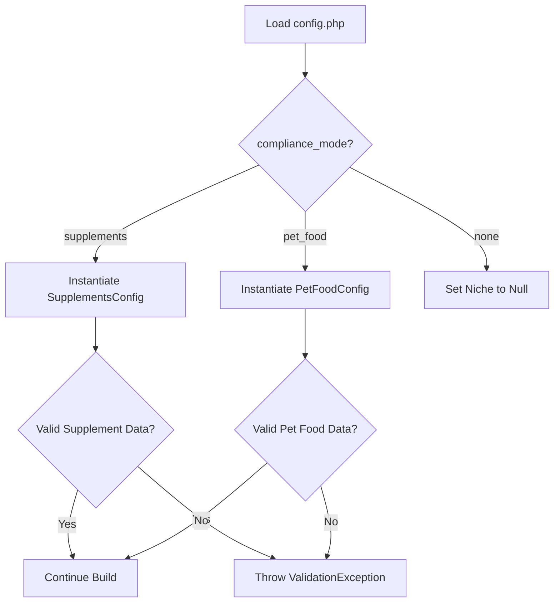

# Polymorphic Niche Configuration

**How Prism Adapts to Different Business Domains Dynamically**

Prism supports diverse industries—from human supplements to pet food—within a single core engine. It achieves this through **Polymorphic Configuration**, allowing the `niche` configuration block to change its shape and validation rules based on the project's mode.

## The Concept

In object-oriented programming, **polymorphism** means an object can take on multiple forms. In Prism, the `niche` field in your `config.php` isn't static.
*   If you sell **Vitamins**, `niche` expects FDA supplement facts.
*   If you sell **Dog Food**, `niche` expects AAFCO guaranteed analysis.

## How It Works

### 1. The Decision Switch
The `compliance_mode` field in `config.php` dictates which set of rules applies.

### 2. The Logic Implementation
Inside `ConfigData.php`, we override the `from()` method. This allows us to inspect the raw configuration before the DTO is fully constructed and decide which class to use for the `niche` property.

```php
// src/Data/ConfigData.php

public static function from(mixed ...$payloads): static
{
    // 1. Get the raw payload
    $payload = $payloads[0] ?? [];
    $complianceMode = $payload['compliance_mode'] ?? 'none';
    $nichePayload = $payload['niche'] ?? [];

    // 2. Polymorphic Switch
    if (is_array($nichePayload)) {
        if ($complianceMode === 'supplements') {
            // Validate against Supplement Rules
            $payload['niche'] = SupplementsConfig::from($nichePayload);
        } elseif ($complianceMode === 'pet_food') {
            // Validate against Pet Food Rules
            $payload['niche'] = PetFoodConfig::from($nichePayload);
        } else {
            $payload['niche'] = null;
        }
    }

    return parent::from($payload, ...array_slice($payloads, 1));
}
```

## Visual Flow



## Configuration Examples

### Scenario A: Human Supplements
When `compliance_mode` is `'supplements'`, the `niche` block **must** contain supplement facts.

```php
// config.php
return [
    'compliance_mode' => 'supplements',
    'niche' => [
        // Validated by SupplementsConfig DTO
        'serving_size' => '2 Capsules',
        'nutrients' => [
            ['name' => 'Vitamin C', 'amount' => '500mg'],
        ],
    ],
];
```

### Scenario B: Pet Food
When `compliance_mode` is `'pet_food'`, the *exact same* `niche` key now expects completely different data.

```php
// config.php
return [
    'compliance_mode' => 'pet_food',
    'niche' => [
        // Validated by PetFoodConfig DTO
        'life_stage' => 'Adult',
        'guaranteed_analysis' => [
            'crude_protein' => '24%',
            'crude_fat' => '14%',
        ],
    ],
];
```

## Benefits

1.  **Strict Validation:** A pet food site cannot accidentally include a Vitamin C table, and a supplement site cannot list "Crude Protein" percentages. The validation ensures the data matches the regulatory requirements.
2.  **Clean Code:** The rest of the application just accesses `$config->niche`. While the specific *type* of that object changes, the high-level concept of "Niche Data" remains consistent.
3.  **Extensibility:** Adding a new niche (e.g., "Cosmetics" with FDA labeling rules) is as simple as creating a `CosmeticsConfig` DTO and adding one `elseif` block to the `ConfigData` class.
