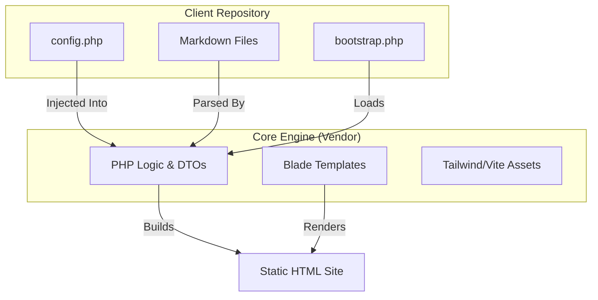

# The Prism "Thin Client" Architecture

**Understanding the Separation of Core Engine and Client Content**

Prism employs a **"Thin Client"** architectural pattern to manage 50+ distinct brand sites efficiently. This approach separates the technical "engine" (logic, templates, build pipeline) from the specific "fuel" (branding, products, content) of each client.

## The Problem: Maintenance Nightmare

In a traditional static site setup, you might clone a starter template 50 times.
*   **Scenario:** You find a bug in the SEO meta tag generation.
*   **Result:** You must manually patch 50 separate repositories.
*   **Risk:** One site might have drifted code, causing the patch to fail.

## The Solution: The Factory Pattern

Prism inverts this. The "site" is actually a dependency installed via Composer.

*   **The Core (`prism` package):** Contains ALL layouts, logic, CSS, build scripts, and regulatory components. It is versioned (e.g., `v1.2.0`).
*   **The Client (Thin Repo):** Contains *only* configuration and content. It requires `prism` as a dependency.

### Visualizing the Relationship



## How It Works

### 1. The Client Repository Structure
A Prism client repo is remarkably empty. It typically contains:

```text
/client-repo
├── bootstrap.php       <-- The "Ignition Key"
├── config.php          <-- The "Brain"
├── composer.json       <-- Requires "vitalcore/prism"
└── source/             
    ├── _products/      <-- Markdown content
    └── assets/         <-- Logo, hero images
```

### 2. The Hook: `bootstrap.php`
Jigsaw (our underlying SSG) looks for a `bootstrap.php` file. In a standard Jigsaw site, you'd write helper functions here. In Prism, we use it to **boot the core**.

```php
// client-repo/bootstrap.php

use Prism\Core\Listeners\BuildValidator;
use Prism\Core\Listeners\TemplateLoader;

// 1. Hook into the build process
$events->beforeBuild([
    // 2. Validate configuration BEFORE doing anything else
    BuildValidator::class,
    
    // 3. Register the core templates so Jigsaw can find them
    TemplateLoader::class, 
]);
```

### 3. The Brain: `config.php`
Instead of editing HTML or Blade files to change the design, the client defines *intent* in `config.php`.

```php
// client-repo/config.php

return [
    'brand' => [
        'name' => 'ZenPet Organics',
        'niche' => 'pet-health', // Triggers "Playful" preset & AAFCO rules
        'colors' => [
            'primary' => '#4ADE80',
        ],
    ],
    'compliance' => [
        'mode' => 'pet-food', // Injects Guaranteed Analysis panels
    ],
];
```

## Benefits

1.  **Instant Fleet Updates:** To fix a bug across all 50 sites, we release `v1.2.1` of the Core. Then, we run `prism update:all` to bump the version in every client repo.
2.  **Enforced Consistency:** A client developer *cannot* accidentally break the layout or remove a mandatory legal disclaimer, because those templates exist in the read-only `vendor/` folder.
3.  **Fail-Fast Safety:** If a client config is missing a required field (like `compliance.mode`), the `BuildValidator` stops the build instantly, preventing a broken site from deploying.
